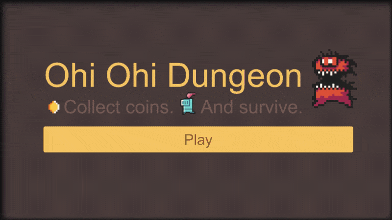
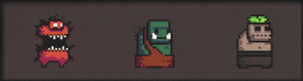

# Ohi Ohi Dungeon

"Ohi Ohi Dungeon" is a small click & collect mobile game developed in Unity. It was originally created as an example project for use in lectures at the university.

Enter dangerous dungeons with your little companion. Fight demons, orcs, and the undead. Defend your little hero from approaching enemies and loot the treasures of the dungeon. How long will you last? How many coins can you collect?

     
     
    
     
     
     

## License & Third-Party Content

"Ohi Ohi Dungeon" is licensed under an MIT license. See the [LICENSE](/LICENSE) file for details.

Several of the assets used in this project were created by other people. Check out the [Third-Party Content](/ThirdPartyContent.md) file for details. The [Dungeon Tileset ii](https://0x72.itch.io/dungeontileset-ii) assets by [Robert Norenberg (aka 0x72)](http://0x72.pl/) especially have to be mentioned here. These assets make up the majority of the game's visuals. A special thanks goes out to Robert Norenberg (and the many others) for making their assets available to the public.

## Support & Contribute

This project was created by [Daniel Dyrda](https://dyrda.page). If you want to support me and my projects, you can follow me on [GitHub (dyrdadev)](https://github.com/dyrdadev) and [Twitter (@daniel_dyrda)](https://twitter.com/daniel_dyrda). Just come by and say hello.

If you want to contribute to this project, you are welcome to do so. Just leave me a message and we will find a way to collaborate.

     
     
    

