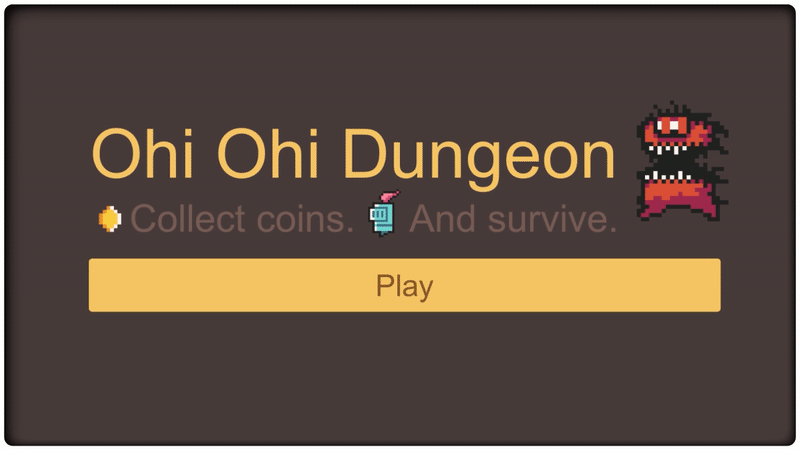

# Ohi Ohi Dungeon

"Ohi Ohi Dungeon" is a small click & collect mobile game developed in Unity. It was originally created as a sample project for use in lectures at the university.

Enter dangerous dungeons with your little companion. Fight demons, orcs and undead. Defend your little hero from approaching enemies and loot the treasures of the dungeon. How long will you last? How many coins can you collect?

     
     
    
     
     
     

## License & Third Party Content

"Ohi Ohi Dungeon" is licensed under a MIT license. See the [LICENSE](/LICENSE) file for details.

Many assets of this project were created by other people. Check out the [Third Party Content](/ThirdPartyContent.md) file for details.

Especially the [Dungeon Tileset ii](https://0x72.itch.io/dungeontileset-ii) assets of [Robert Norenberg (aka 0x72)](http://0x72.pl/) have to be mentioned here. Robert's assets make up the majority of the game's visuals. A special thanks to Robert (and the many others) for making their assets available to the general public.

## Support & Contribute

This project was created by [Daniel Dyrda](https://dyrda.io). If you want to support me and my projects, you can follow me on [github (dyrdaio)](https://github.com/dyrdaio) and [twitter (@dyrdaio)](https://twitter.com/dyrdaio). Just come by and say hello, I would love to hear how you use the project.

If you want to contribute to this project, you are welcome to do so. Just write me, and we will find a way to collaborate.
